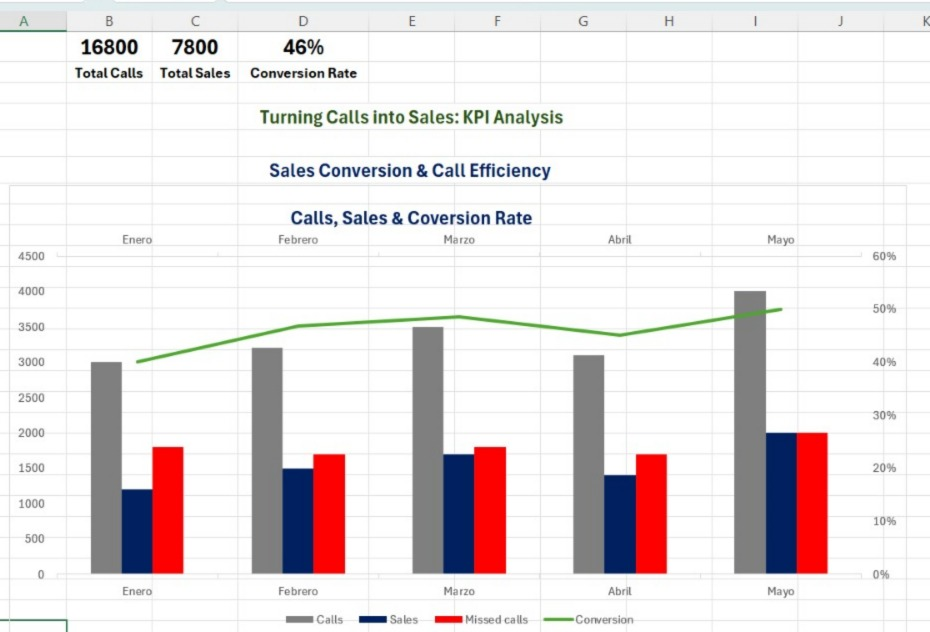

# 📊 Call Center KPI Analysis

## 📌 Project Overview
This project analyzes call center performance using key business KPIs 
to evaluate efficiency, sales conversion, and missed opportunities.

## 🎯 Objective
Evaluate efficiency and identify opportunities to improve conversion rates and reduce missed calls.

## 📊 Key Insights
- Conversion rate increased from 40% to 50% over time
- Missed calls remain high, indicating potential lost revenue
- Sales trend follows call volume but not perfectly → opportunity to optimize

## 📁 Files
- `DATA06.xlsx` → raw dataset used for analysis  
- `dashboard.png` → final KPI dashboard visualization  

## 📷 Dashboard Preview

## 📈 KPIs Tracked
- Call Volume
- Sales Performance
- Conversion Rate
- Missed Call Rate

## 💡 Business Value
This analysis helps identify inefficiencies in call handling, 
optimize conversion rates, and reduce revenue loss from missed calls.

## 🚀 Next Steps
- Improve conversion tracking
- Reduce missed calls through staffing optimization
- Integrate real-time dashboarding tools

## 🛠 Tools Used
- Excel (Data analysis & dashboard)
- SQL (data exploration)
- Git & GitHub (version control)

